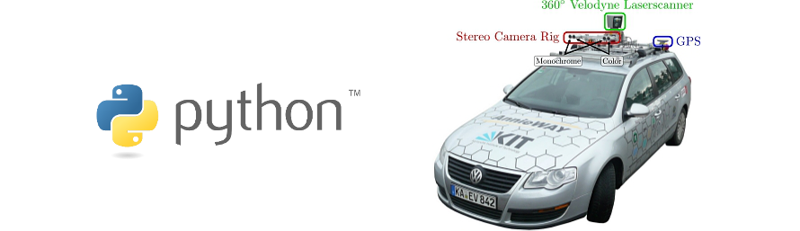

# pykitti


This package provides a minimal set of tools for working with the KITTI dataset [[1]](#references) in Python. So far only the raw datasets and odometry benchmark datasets are supported, but we're working on adding support for the others. We welcome contributions from the community.

## Installation

### Using pip
You can install pykitti via pip using
```
pip install pykitti
```

### From source
To install the package from source, simply clone or download the repository to your machine
```
git clone https://github.com/utiasSTARS/pykitti.git
```
and run the provided setup tool
```
cd pykitti
python setup.py install
```

## Assumptions
This package assumes that you have also downloaded the calibration data associated with the sequences you want to work on (these are separate files from the sequences themselves), and that the directory structure is unchanged from the original structure laid out in the KITTI zip files.

## Notation
Homogeneous coordinate transformations are provided as 4x4 `numpy.array` objects and are denoted as `T_destinationFrame_originFrame`.

Pinhole camera intrinsics for camera `N` are provided as 3x3 `numpy.array` objects and are denoted as `K_camN`. Stereo pair baselines are given in meters as `b_gray` for the monochrome stereo pair (`cam0` and `cam1`), and `b_rgb` for the color stereo pair (`cam2` and `cam3`).

## Example
More detailed examples can be found in the `demos` directory, but the general idea is to specify what dataset you want to load, then access the parts you need and do something with them.

```python
import pykitti

basedir = '/your/dataset/dir'
date = '2011_09_26'
drive = '0019'

# The 'frames' argument is optional - default: None, which loads the whole dataset.
# Calibration and timestamp data are read automatically. 
# Other sensor data (cameras, IMU, Velodyne) are available via properties 
# that create generators when accessed.
data = pykitti.raw(basedir, date, drive, frames=range(0, 50, 5))

# dataset.calib:      Calibration data are accessible as a named tuple
# dataset.timestamps: Timestamps are parsed into a list of datetime objects
# dataset.oxts:       Returns a generator that loads OXTS packets as named tuples
# dataset.camN:       Returns a generator that loads individual images from camera N
# dataset.gray:       Returns a generator that loads monochrome stereo pairs (cam0, cam1)
# dataset.rgb:        Returns a generator that loads RGB stereo pairs (cam2, cam3)
# dataset.velo:       Returns a generator that loads velodyne scans as [x,y,z,reflectance]

point_velo = np.array([0,0,0,1])
point_cam0 = data.calib.T_cam0_velo.dot(point_velo)

point_imu = np.array([0,0,0,1])
point_w = [o.T_w_imu.dot(point_imu) for o in data.oxts]

for cam0_image in data.cam0:
    pass

rgb_iterator = data.rgb # Assign the generator so it doesn't 
cam2_image, cam3_image = next(rgb_iterator)
```
### OpenCV
Image data can be automatically converted to an OpenCV-friendly format (i.e., `uint8` with `BGR` color channel ordering) simply by specifying an additional parameter in the constructor:

```python
data = pykitti.raw(basedir, date, drive, frames=range(0, 50, 5), imformat='cv2')
```

Note: This package does not actually require that OpenCV be installed on your system, except to run `demo_raw_cv2.py`.

## References
[1] A. Geiger, P. Lenz, C. Stiller, and R. Urtasun, "Vision meets robotics: The KITTI dataset," Int. J. Robot. Research (IJRR), vol. 32, no. 11, pp. 1231–1237, Sep. 2013. [http://www.cvlibs.net/datasets/kitti/](http://www.cvlibs.net/datasets/kitti/)
`